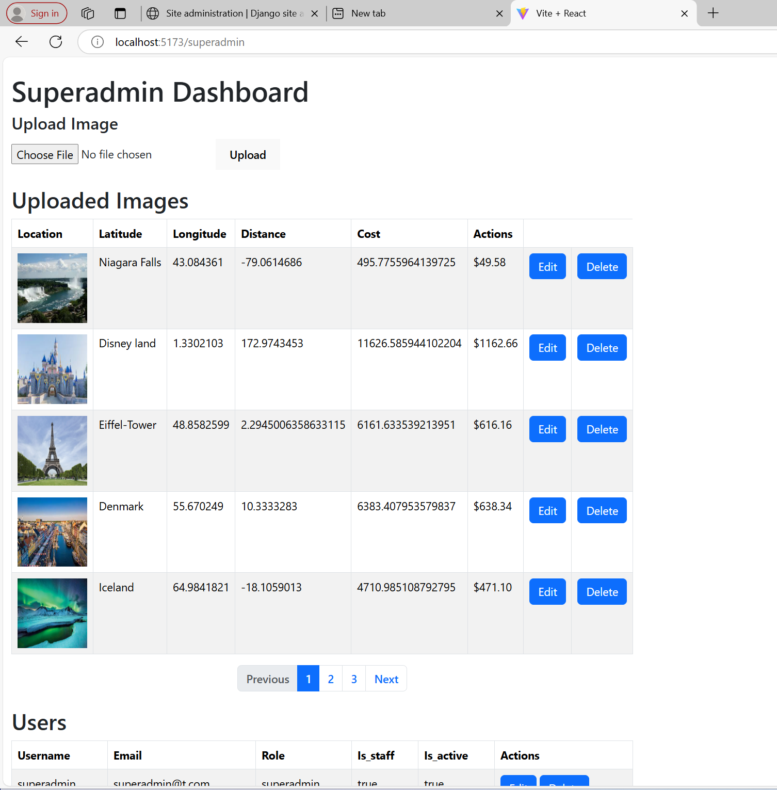
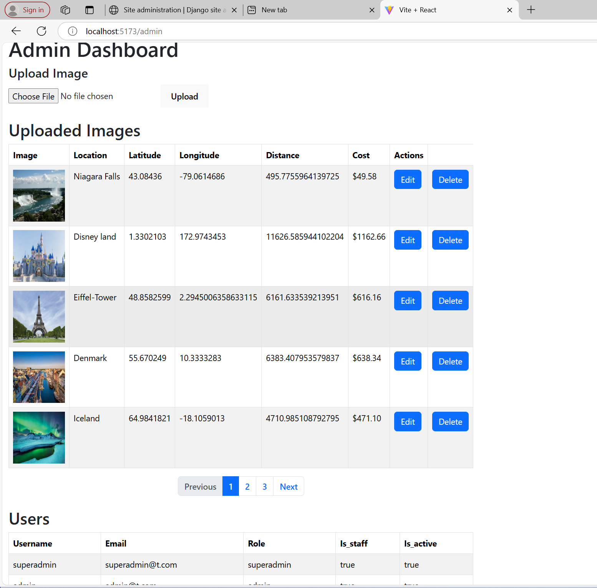
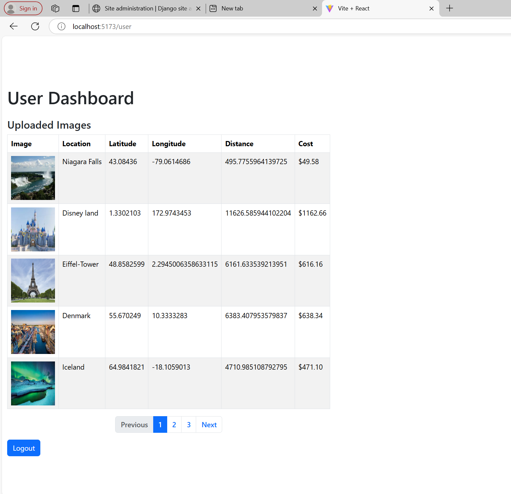

# GeoVision AI


## Overview
GeoVision AI is a Deep Learning-based application that extracts location names from images, retrieves their coordinates, calculates distances, and estimates transportation costs. It includes a Django backend with a React frontend for visualization. The dashboard is role-based, meaning access to different features is determined by the user role (Admin, User, Super Admin).

## Features
- **Role-Based Dashboard**: The dashboard displays different functionalities based on the user's role:
  - **Super Admin**: Has full access, including user management and all dashboard functionalities.
  - **Admin**: Can manage image locations and view basic user data.
  - **User**: Limited to viewing uploaded images and calculated distances/costs.
  
- **Image Upload**: Supports single and bulk image uploads.
- **Location Extraction**: Uses a Deep Learning model (PyTorch) to extract location names from images.
- **Geolocation API**: Converts location names into latitude and longitude.
- **Distance Calculation**: Computes distance between extracted locations.
- **Cost Estimation**: Calculates transportation cost (10 cents per mile).
- **Data Visualization**: React frontend displays extracted locations, mapped coordinates, and cost breakdowns using charts.
- **Pagination**: Implements pagination for better data handling.
- **User Management**: Admin and Super Admin can manage users and their roles.

## Tech Stack
### Backend
- **Django** & **Django REST Framework**
- **PyTorch** (for Deep Learning model)
- **MySQL** (for metadata storage)

### Frontend
- **React.js** (for user interface)
- **Vite** (for faster frontend builds)
- **Chart.js / Recharts** (for data visualization)
- **Bootstrap** (for styling and responsive design)

### Cloud Infrastructure
- **Azure (IaaS, PaaS, SaaS)**

## Installation
### Prerequisites
- Python 3.x
- Node.js & npm
- MySQL

### Backend Setup
1. Clone the repository:
   ```sh
   git clone https://github.com/your-repo/location-finder.git
   cd location-finder/backend
   ```
2. Create a virtual environment:
   ```sh
   python -m venv venv
   source venv/bin/activate  # On Windows use `venv\Scripts\activate`
   ```
3. Install dependencies:
   ```sh
   pip install -r requirements.txt
   ```
4. Apply database migrations:
   ```sh
   python manage.py migrate
   ```
5. Run the backend server:
   ```sh
   python manage.py runserver
   ```

### Frontend Setup
1. Navigate to the frontend directory:
   ```sh
   cd ../frontend
   ```
2. Install dependencies:
   ```sh
   npm install
   ```
3. Bootstrap the project:
   ```sh
   npm run bootstrap
   ```
4. Start the development server:
   ```sh
   npm run dev
   ```

## API Endpoints
| Method | Endpoint | Description |
|--------|----------|-------------|
| POST   | `/api/login/` | User login |
| POST   | `/api/predict-location/` | Predict location from image |
| GET    | `/api/image-locations/` | Retrieve list of image locations |
| GET    | `/api/image-location/<int:pk>/` | Retrieve details of an image location |
| PUT    | `/api/image-location/<int:pk>/update/` | Update image location (Admin, Super Admin) |
| DELETE | `/api/image-location/<int:pk>/delete/` | Delete image location (Admin, Super Admin) |
| POST   | `/api/token/` | JWT authentication - Obtain token |
| POST   | `/api/token/refresh/` | JWT authentication - Refresh token |
| GET    | `/api/users/` | List all users (Admin, Super Admin) |
| POST   | `/api/user/create/` | Create a new user (Admin, Super Admin) |
| GET    | `/api/user/<int:pk>/` | Retrieve, update, or delete a specific user (Super Admin) |

## User Roles and Access
- **Super Admin**: Full access to all features, including user management and image location administration.
  


- **Admin**: Can manage image locations and view some data but cannot manage users.
  


- **User**: Can only view image locations, their details, and the calculated distance/cost.
  


## Contributing
1. Fork the repository.
2. Create a feature branch (`git checkout -b feature-branch`).
3. Commit your changes (`git commit -m "Add new feature"`).
4. Push to the branch (`git push origin feature-branch`).
5. Create a pull request.

## License
This project is licensed under the MIT License.

